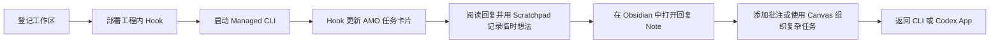

# AMO

AMO（Agent Monitor Overlay）是一层面向 Windows 本地 AI CLI 工作流的轻量控制界面。

它通过工程内 Hook 跟踪 Codex CLI 和 Claude CLI 会话，将任务呈现为桌面卡片，并把长回复的审阅流程连接到 Obsidian 笔记、批注和 Canvas。

> AMO 首先是一款为个人工作方式设计的软件。它来自一个开发者每天真实遇到的痛点，而不是从“通用 Agent 平台”这个目标反推出来的产品。

<!-- 素材待补：10-15 秒 GIF。
画面内容：在同一个工作区启动两个 Managed CLI；其中一张卡片进入 Review；
打开 Note，在 Obsidian 中添加一条引用批注，然后返回 CLI。
只保留 AMO、终端和 Obsidian；隐藏工程源码、用户路径、Session ID 和私人 Prompt。 -->

## 为什么做 AMO

AMO 围绕框架开发中反复出现的三个问题设计。

### 审阅会产生比答案更多的新想法

当大部分任务都在搭建或调整底层框架时，审阅实现细节和产出代码同样重要。疑问、遗漏的约束和新的方向，经常是在阅读一段很长的 AI 回复时出现，而不是读完以后才出现。

AMO 把回复保存为 Obsidian 笔记，使用户可以直接批注触发想法的原文，汇总这些批注，再返回对应的 CLI 或 App 继续推进。

### 多工程、多会话会快速耗尽上下文

最初的工作流包含两份本地 Unity 工程，每个工程又经常同时运行两到三个 CLI，分别处理不同模块。切换次数多了以后，确认哪个窗口属于哪个任务，甚至会比重新开一个任务更费力。

AMO 的任务卡片把工作区、Provider、会话状态、注意力状态和窗口跳转放在一起。目标并不是同时操作更多 Agent，而是让少量并行任务始终容易理解和找回。

### 跨天任务会超出人的工作记忆

一个延续到第二天的任务，聊天记录可能仍然完整，但当时的推理上下文已经断掉了。

- **任务卡片**展示任务正在运行、空闲、请求处理还是等待审阅。
- **Note**保存完整回复和人的批注。
- **Canvas**保存复杂任务中的分支、关系和手动整理的上下文。
- **Scratchpad**在阅读过程中即时接住尚未成形、还不值得写成正式批注的想法。

它们共同提供一条重新进入任务的路径，避免每次都从头翻阅整段对话。

> [!TIP]
> **使用前提示**
>
> - AMO 针对作者自己的跨工程、多 CLI 和长任务审阅习惯设计。如果你的开发方式和这些痛点不同，不必为了使用 AMO 改变原有工作流。尤其当 Codex App 已经是你的主要工作界面时，它本身对多线任务、注释、Side Chat 和更多详情的支持可能已经足够，不需要强行再叠加一层 AMO。
> - 作者本人使用 AMO 的强度很高，项目很可能会持续随个人工作流快速迭代，目前没有把某个版本长期冻结为稳定 Release 的计划。如果想认真尝试，推荐先 Fork 仓库，再根据自己的 CLI、快捷键、审阅习惯和知识库结构进行定制。
> - Claude CLI 不是作者日常开发中的主力路径，Claude Adapter 的实际使用覆盖和稳定性可能弱于 Codex CLI。遇到问题时请优先保留复现步骤和 Hook 日志，也欢迎针对自己的环境直接调整适配逻辑。

## 当前工作流

AMO 当前主要面向 Windows x64，已经支持以下工作路径：

| 集成 | 当前作用 |
| --- | --- |
| Codex CLI | 工程内 Hook、Managed Launch/Resume、Prompt/Reply/Permission 生命周期 |
| Claude CLI | 工程内 Hook、Managed Launch/Resume、Prompt/Reply/Permission 生命周期 |
| Codex App | 任务卡片的显式 Target，以及打开对应对话 |
| Obsidian | AMO Vault、生成笔记、批注、Canvas 和返回会话操作 |
| Scratchpad | 三页全局临时写作面板，并提供适合 CLI 粘贴的安全复制 |

AMO 不会安装或替代这些应用。每项集成都仍然是可选的外部依赖。

## 五分钟上手

1. 从 [GitHub Releases](https://github.com/kadhygh/AgentMonitorOverlay/releases) 下载最新的 Windows x64 Portable ZIP。
2. 将完整 ZIP 解压到可写目录，启动 `AMO.exe`。
3. 打开 **Workspace Center**，选择工程目录并执行 **Check**。
4. 选择 Codex CLI 和/或 Claude CLI Adapter，部署工程内 Hook 和 `.amo` 工作区。
5. 在 Obsidian 中将生成的 `.amo/obsidian-vault` 作为 Vault 打开一次。
6. 在 AMO 设置的 **Scratchpad** 页面启用适合自己的全局快捷键；阅读长回复时随时呼出三页临时面板，记录准备回复或需要继续确认的内容。
7. 从 Workspace Center 启动 Managed CLI，并开始一轮对话。
8. 当任务卡片进入 Review，打开对应 Note；需要精确回应原文时添加批注，需要梳理分支时再使用 Canvas。
9. 使用 Obsidian 的 AMO 面板返回对应会话，或从 Scratchpad 安全复制整理中的想法。

前置条件、部署细节和首次启动排错见 [入门指南](docs/getting-started.md)。

<!-- 截图待补：Workspace Center 完成 Check 后的状态。
展示一个可公开的测试工作区、Codex + Claude Adapter 状态、Deploy 操作和 Managed Launch 按钮。
使用类似 C:\Projects\amo-demo 的中性路径。 -->

## 两种主要使用方式

### 常规审阅：优先使用 Note

多数任务不需要 Canvas。打开最新 Reply Note，选择需要回应的原句，添加引用批注，再把汇总后的反馈返回会话。这样可以让审阅紧贴原文，也不必为普通任务额外举行一次“规划仪式”。

见 [使用 Note 审阅](docs/workflows/note-review.md)。

### 复杂任务：使用 Canvas 组织

当任务出现分支、多个互斥方案，或者某些关系需要超越聊天时间线长期保留时，再使用 Canvas。AMO 会维护自动生成的 Base Flow；用户也可以把选中的 Note 添加到自己整理的 Work Canvas。

见 [使用 Canvas 组织复杂任务](docs/workflows/canvas-work.md)。

## 快捷键

作者高频使用鼠标侧键组合，这是个人工作习惯，不是适合所有人的通用默认值。AMO 的全局 Scratchpad 快捷键和 Obsidian 插件命令均支持用户配置；个人覆盖配置会与代码内默认值分离，避免更新时被覆盖。没有鼠标侧键的用户也可以选择键盘组合或关闭对应快捷键。

具体行为和兼容规则见 [快捷键配置](docs/shortcut-configuration.md)。

## 本地优先的数据设计

AMO 围绕本地进程和工程内文件工作。会话笔记、Canvas、已部署 Hook 和工作区元数据位于所选工程的 `.amo` 目录中。Portable 应用自身的状态位于解压目录旁的 `data/` 中。

在敏感工程中使用 AMO 或公开本仓库前，请先阅读 [本地数据与隐私](docs/data-and-privacy.md)。完整的外发网络与遥测审计仍属于公开发布检查项。

## 开发

当前源码包含 Tauri Overlay、Node Broker、工程内 Adapter、Obsidian 插件、构建脚本和历史设计文档。建议先阅读 [工程结构](docs/project-structure.md) 和 [公开发布路线](docs/public-release-roadmap.md)。

开发与发布命令见 [Portable 发布 SOP](docs/portable-release-sop.md)。

## 协议与商标

AMO 源码和原创资产使用 [MIT License](LICENSE) 发布。

Codex、Claude、Obsidian、Zed、Windows 及其他产品名称和商标属于各自权利人。本文中的名称仅用于说明可选的互操作能力，不表示任何关联、背书或赞助关系。依赖和第三方资产状态见 [第三方声明](THIRD_PARTY_NOTICES.md)。
