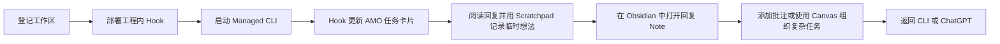

# AMO

AMO（Agent Monitor Overlay）是一层面向 Windows 本地 AI CLI 工作流的轻量控制界面。

它通过工程内 Hook 跟踪 Codex CLI 和 Claude CLI 会话，将任务呈现为桌面卡片，并把长回复的审阅流程连接到 Obsidian 笔记、批注和 Canvas。

> AMO 先解决作者自己的问题，不以成为通用 Agent 平台为目标。

<!-- 素材待补：10-15 秒 GIF。
画面内容：在同一个工作区启动两个 Managed CLI；其中一张卡片进入 Review；
打开 Note，在 Obsidian 中添加一条引用批注，然后返回 CLI。
只保留 AMO、终端和 Obsidian；隐藏工程源码、用户路径、Session ID 和私人 Prompt。 -->

## 为什么做 AMO

AMO 最早不是一个产品规划，而是我为了处理自己的开发痛点做出来的工具。

### 我需要认真读完 LLM 的长回复

我的很多任务都涉及底层框架，所以收到回复以后，不能只看结论，通常要从开头逐行检查。

问题是，阅读过程中经常会产生新的疑问、补充条件和实现思路。CLI 很适合对话，却不太适合一边阅读长回复，一边对原文做批注和整理。

因此 AMO 会把回复保存到 Obsidian。明确的问题可以直接标在原文旁边，暂时没想清楚的内容可以先写进 Scratchpad，最后再统一返回会话。

### 我经常同时打开多个工程和多个 CLI

我本地有两份 Unity 工程，每个工程又可能同时运行两三个 CLI。任务切换多了以后，很容易忘记每个窗口对应什么任务，以及现在究竟在等谁。

AMO 用任务卡片把工程、Session、状态和窗口关联起来，让这些并行任务不再完全依赖记忆。

### 长任务到了第二天，很难接回原来的思路

聊天记录还在，不代表当时的思路还在。

AMO 使用 Note 保存回复和批注，使用 Canvas 整理复杂任务的分支，使用 Scratchpad 记录临时想法。它们共同解决的是同一件事：让我在切换任务或隔天回来以后，可以更快继续工作。

## 先确认你是否真的需要 AMO

AMO 不是使用 Codex 的必备工具，也不打算替代现有的 CLI、ChatGPT desktop app 或 Obsidian 工作流。如果你没有上面这些痛点，不建议为了使用 AMO 强行改变自己的开发习惯。

尤其是以 ChatGPT desktop app（原 Codex App）为主力界面时，建议先直接使用它。ChatGPT desktop app 已经很适合[按 Project 管理多条任务](https://openai.com/index/introducing-the-codex-app/)，也提供了[批注](https://openai.com/index/codex-for-every-role-tool-workflow/)、More details 和 Side Chat 等审阅与补充沟通能力。只要你不需要同时管理多个工程里的大量 CLI，不需要把回复长期沉淀进 Obsidian，也不需要使用 Canvas 手动整理任务关系，它本身很可能已经够用。

AMO 更适合下面这些情况：

- 同时在多个工程中运行多个 CLI，需要统一查看状态和跳转窗口；
- 需要逐段审阅长回复，并把问题准确地标在原文旁边；
- 希望把回复、批注和跨天任务上下文长期留在自己的 Obsidian Vault；
- 需要用 Canvas 手动组织复杂任务的分支和关系；
- 经常在不同窗口间阅读内容，需要一个随时可呼出的全局 Scratchpad。

作者本人使用 AMO 的强度很高，它很可能会继续跟随个人工作流快速变化。目前没有把某个版本长期冻结为稳定 Release 的计划。如果你确实想长期使用，推荐先 Fork 仓库，再根据自己的 CLI、快捷键、审阅方式和知识库结构进行定制。

另外，Claude CLI 不是作者日常开发中的主力路径。Claude Adapter 已经接入，但实际覆盖和稳定性可能弱于 Codex CLI；遇到问题时建议保留复现步骤和 Hook 日志，并针对自己的环境调整适配逻辑。

## 当前工作流

AMO 当前主要面向 Windows x64，已经支持以下工作路径：

| 集成 | 当前作用 |
| --- | --- |
| Codex CLI | 工程内 Hook、Managed Launch/Resume、Prompt/Reply/Permission 生命周期 |
| Claude CLI | 工程内 Hook、Managed Launch/Resume、Prompt/Reply/Permission 生命周期 |
| ChatGPT desktop app | 任务卡片的显式 Target，以及打开对应任务 |
| Obsidian | AMO Vault、生成笔记、批注、Canvas 和返回会话操作 |
| Scratchpad | 三页全局临时写作面板，并提供适合 CLI 粘贴的安全复制 |

AMO 不会安装或替代这些应用。每项集成都仍然是可选的外部依赖。

## 五分钟上手

1. 从 [GitHub Releases](https://github.com/kadhygh/AgentMonitorOverlay/releases) 下载最新的实验性 Windows x64 Portable ZIP。
2. 将完整 ZIP 解压到可写目录，启动 `AMO.exe`。
3. 打开 **Workspace Center**，选择工程目录并执行 **Check**。
4. 选择 Codex CLI 和/或 Claude CLI Adapter，部署工程内 Hook 和 `.amo` 工作区。
5. 在 Obsidian 中将生成的 `.amo/AMO - <工程名>` 目录作为 Vault 打开一次。
6. 在 AMO 设置的 **Scratchpad** 页面启用适合自己的全局快捷键；阅读长回复时随时呼出三页临时面板，记录准备回复或需要继续确认的内容。
7. 从 Workspace Center 启动 Managed CLI，并开始一轮对话。
8. 当任务卡片进入 Review，打开对应 Note；需要精确回应原文时添加批注，需要梳理分支时再使用 Canvas。
9. 使用 Obsidian 的 AMO 面板返回对应会话，或从 Scratchpad 安全复制整理中的想法。

前置条件、部署细节和首次启动排错见 [入门指南](docs/getting-started.md)。

<!-- 截图待补：Workspace Center 完成 Check 后的状态。
展示一个可公开的测试工作区、Codex + Claude Adapter 状态、Deploy 操作和 Managed Launch 按钮。
使用类似 C:\Projects\amo-demo 的中性路径。 -->

## 两种主要使用方式

### 常规审阅：优先使用 Note

多数任务不需要 Canvas。打开最新 Reply Note，选择需要回应的原句，添加引用批注，再把汇总后的反馈返回会话。这样可以让审阅紧贴原文，也不必为普通任务额外举行一次“规划仪式”。

见 [使用 Note 审阅](docs/workflows/note-review.md)。

### 复杂任务：使用 Canvas 组织

当任务出现分支、多个互斥方案，或者某些关系需要超越聊天时间线长期保留时，再使用 Canvas。AMO 会维护自动生成的 Base Flow；用户也可以把选中的 Note 添加到自己整理的 Work Canvas。

见 [使用 Canvas 组织复杂任务](docs/workflows/canvas-work.md)。

## 快捷键

作者高频使用鼠标侧键组合，这是个人工作习惯，不是适合所有人的通用默认值。AMO 的全局 Scratchpad 快捷键和 Obsidian 插件命令均支持用户配置；个人覆盖配置会与代码内默认值分离，避免更新时被覆盖。没有鼠标侧键的用户也可以选择键盘组合或关闭对应快捷键。

具体行为和兼容规则见 [快捷键配置](docs/shortcut-configuration.md)。

## 本地优先的数据设计

AMO 围绕本地进程和工程内文件工作。会话笔记、Canvas、已部署 Hook 和工作区元数据位于所选工程的 `.amo` 目录中。Portable 应用自身的状态位于解压目录旁的 `data/` 中。

在敏感工程中使用 AMO 前，请先阅读 [本地数据与隐私](docs/data-and-privacy.md)，确认工程内生成内容、Portable 状态和外部工具调用符合自己的安全要求。

## 开发

当前源码包含 Tauri Overlay、Node Broker、工程内 Adapter、Obsidian 插件、构建脚本和历史设计文档。参与开发前建议先阅读 [开发指南](DEVELOPMENT.md)、[逻辑模块架构](docs/amo-module-architecture.md) 和 [工程结构](docs/project-structure.md)。

开发与发布命令见 [Portable 发布 SOP](docs/portable-release-sop.md)。

## 协议与商标

AMO 源码和原创资产使用 [MIT License](LICENSE) 发布。

Codex、Claude、Obsidian、Zed、Windows 及其他产品名称和商标属于各自权利人。本文中的名称仅用于说明可选的互操作能力，不表示任何关联、背书或赞助关系。依赖和第三方资产状态见 [第三方声明](THIRD_PARTY_NOTICES.md)。
