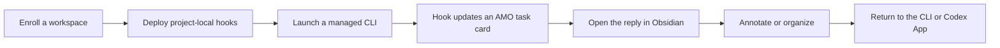

# AMO

AMO (Agent Monitor Overlay) is a lightweight Windows control layer for local AI CLI workflows.

It tracks Codex CLI and Claude CLI sessions through project-local hooks, presents the sessions as desktop task cards, and connects long-form review work to Obsidian notes, annotations, and canvases.

> AMO is personal-first software. It began as a direct response to one developer's daily workflow rather than an attempt to become a universal agent platform.

<!-- MEDIA TODO: Replace this comment with a 10-15 second GIF.
Capture: launch two managed CLI sessions in one workspace, let one card enter Review,
open its Note, add one quoted annotation in Obsidian, then return to the CLI.
Crop to AMO + terminal + Obsidian only. Hide project source, user paths, session IDs, and private prompts. -->

## Why AMO Exists

AMO was designed around three recurring problems in framework-heavy development.

### Review creates more thoughts than answers

When most tasks involve building or changing foundations, reviewing implementation details matters as much as producing code. Questions, missing constraints, and new directions often appear while reading a long AI response, not after it.

AMO stores replies as Obsidian notes so the reader can annotate the exact passage that triggered a thought, collect those annotations, and return them to the corresponding CLI or app.

### Multiple projects multiply context switching

The original workflow runs two local Unity projects, often with two or three CLI sessions per project working on different modules. After enough switching, remembering which window owns which task becomes harder than starting another task.

AMO task cards keep workspace, provider, session state, attention state, and window routing together. The goal is not to operate more agents at once; it is to make a small number of parallel tasks understandable.

### Long tasks outlive working memory

A task that crosses into the next day may still have a complete chat history while its reasoning context has disappeared.

- **Task Cards** show what is active, waiting, or ready for review.
- **Notes** preserve complete replies and human annotations.
- **Canvas** preserves branches, relationships, and manually organized context for complex work.
- **Scratchpad** catches unfinished thoughts while reading, before they deserve a permanent note.

Together they provide a path back into the work without rereading an entire conversation.

## Current Workflow

AMO currently focuses on Windows x64 and supports these working paths:

| Integration | Current role |
| --- | --- |
| Codex CLI | Project-local hooks, managed launch/resume, prompt/reply/permission lifecycle |
| Claude CLI | Project-local hooks, managed launch/resume, prompt/reply/permission lifecycle |
| Codex App | Explicit task-card target and conversation opening |
| Obsidian | AMO vault, generated notes, annotations, Canvas support, return-to-session actions |
| Scratchpad | Three-page global temporary writing surface with safe copy |

AMO does not install or replace these applications. Each integration remains an optional external dependency.

## Five-Minute Start

1. Download the latest Windows x64 Portable ZIP from [GitHub Releases](https://github.com/kadhygh/AgentMonitorOverlay/releases).
2. Extract the complete ZIP to a writable folder and start `AMO.exe`.
3. Open **Workspace Center**, choose a project folder, and run **Check**.
4. Select the Codex CLI and/or Claude CLI adapter, then deploy the project-local hooks and `.amo` workspace.
5. Open the generated `.amo/obsidian-vault` folder as an Obsidian vault once.
6. Launch a managed CLI from Workspace Center and start a conversation.
7. When the task card enters Review, open its Note, add annotations, and use the AMO Obsidian panel to return to the matching session.

See [Getting Started](docs/getting-started.md) for prerequisites, deployment details, and first-run troubleshooting.

<!-- SCREENSHOT TODO: Workspace Center after Check.
Show one real but disposable workspace, Codex + Claude adapter status, Deploy actions,
and managed launch buttons. Use a neutral path such as C:\Projects\amo-demo. -->

## Two Ways To Work

### Normal review: Note first

For most tasks, Canvas is unnecessary. Open the latest reply note, select the relevant sentence, add a quoted annotation, and return the collected feedback to the session. This keeps review close to the source without requiring a separate planning ceremony.

Read [Reviewing With Notes](docs/workflows/note-review.md).

### Complex work: organize with Canvas

Use Canvas when a task develops branches, competing approaches, or relationships that should survive beyond the chat chronology. AMO maintains the generated base flow; selected notes can also be added to a manually curated work canvas.

Read [Organizing Complex Work](docs/workflows/canvas-work.md).

## Shortcuts

Mouse side-button combinations used by the author are personal workflow choices, not universal defaults. The public shortcut model will keep AMO actions configurable, preserve local overrides during updates, and support users without extra mouse buttons.

The shortcut behavior and compatibility rules are tracked in [Shortcut Configuration](docs/shortcut-configuration.md).

## Local-First Data

AMO is designed around local processes and project-local files. Session notes, canvases, deployed hooks, and workspace metadata live under the selected project's `.amo` folder. Portable application state lives beside the extracted application under `data/`.

Before using AMO on sensitive projects or publishing this repository, read [Local Data and Privacy](docs/data-and-privacy.md). A complete outbound-network and telemetry audit remains part of the public-release gate.

## Development

The current source tree contains the Tauri overlay, Node broker, project-local adapters, Obsidian plugin, build scripts, and historical design documents. Start with [Project Structure](docs/project-structure.md) and the [Public Release Roadmap](docs/public-release-roadmap.md).

Development and release commands are documented in [Portable Release SOP](docs/portable-release-sop.md).

## License And Trademarks

AMO source code and original assets are released under the [MIT License](LICENSE).

Codex, Claude, Obsidian, Kiro, Zed, Windows, and other product names and marks belong to their respective owners. Their use describes optional interoperability and does not imply affiliation, endorsement, or sponsorship. See [Third-Party Notices](THIRD_PARTY_NOTICES.md) for dependency and asset status.

