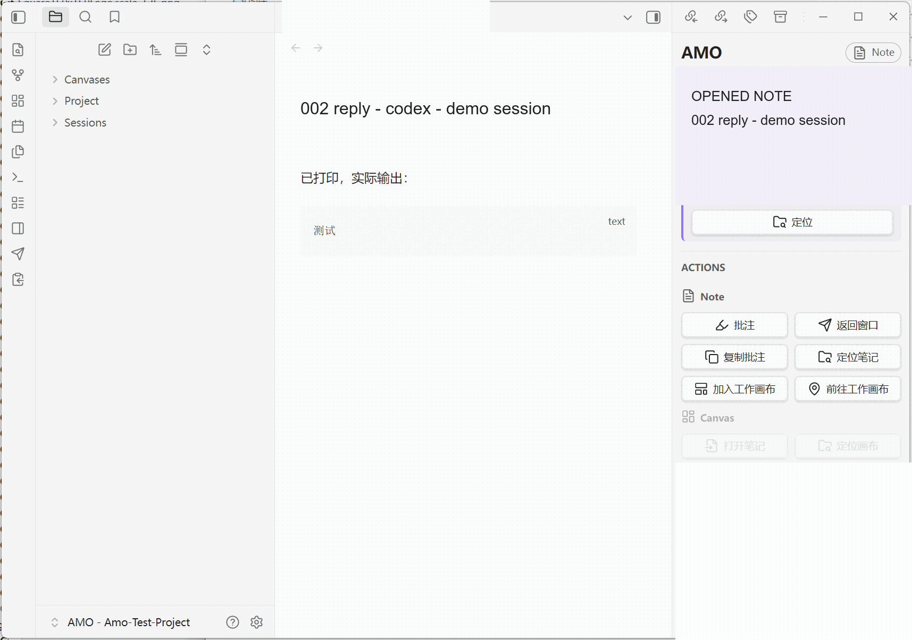
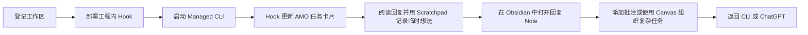
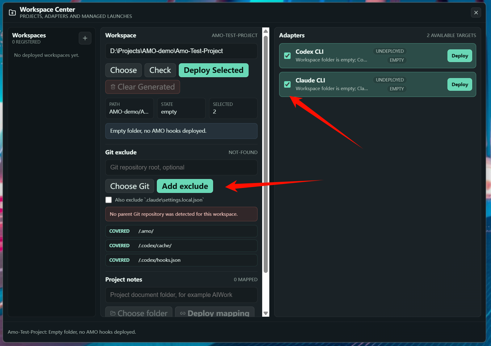
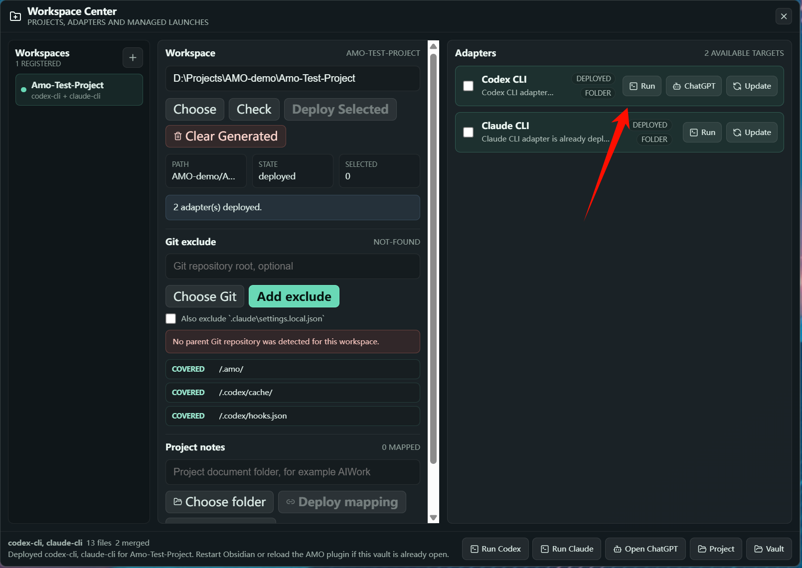
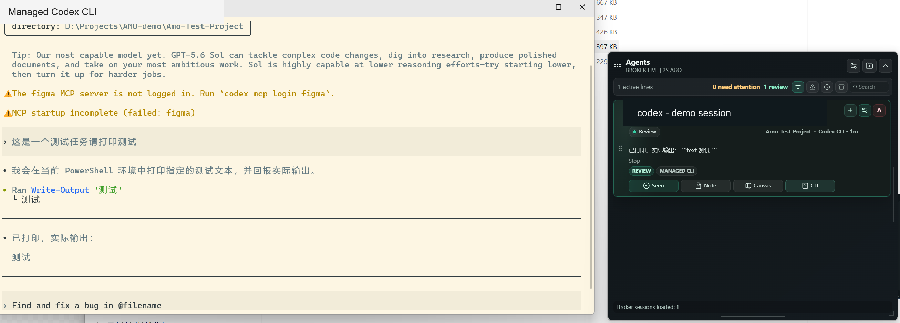

# AMO

AMO（Agent Monitor Overlay）是一层面向 Windows 本地 AI CLI 工作流的轻量控制界面。

它通过工程内 Hook 跟踪 Codex CLI 和 Claude CLI 会话，将任务呈现为桌面卡片，并把长回复的审阅流程连接到 Obsidian 笔记、批注和 Canvas。

> AMO 先解决作者自己的问题，不以成为通用 Agent 平台为目标。

  

上图展示了 AMO 的主要审阅闭环：从任务卡片打开回复 Note，在 Obsidian 中选中原文并添加引用批注，整理完意见后返回对应的 Managed CLI。

## 最新更新

### Claude Code Managed CLI：GLM 与 DeepSeek 路由

AMO 现在可以为由它拉起的 Claude Code CLI（界面中的 **Claude CLI**）单独配置模型路由。打开 **Settings → Models**，分别保存 `DeepSeek API Key` 或 `GLM Coding Plan API Key`，并按需把 **DeepSeek V4 Pro** 或 **GLM-5.2** 设为默认 Claude 路由。之后从 Workspace Center 点击 **Run Claude**，Launch Task 会显示 **Model routing**；可以使用默认值，也可以只为本次启动改回 Claude default 或切换到另一个已配置的提供方。

该路由只影响这次 Managed Claude CLI 进程，不会覆盖用户现有的全局 Claude Code 配置。保存的 Key 位于当前 Windows 用户的 Credential Manager；启动时只写入临时 Claude settings，Claude 退出后删除，不进入 localStorage、Broker 状态、工程文件或日志。具体步骤见[入门指南中的 Claude 模型路由](docs/getting-started.md#claude-model-routing-glm-and-deepseek)。

## 为什么做 AMO

AMO 最早不是一个产品规划，而是我为了处理自己的开发痛点做出来的工具。

### 我需要认真读完 LLM 的长回复

我的很多任务都涉及底层框架，所以收到回复以后，不能只看结论，通常要从开头逐行检查。

问题是，阅读过程中经常会产生新的疑问、补充条件和实现思路。CLI 很适合对话，却不太适合一边阅读长回复，一边对原文做批注和整理。

因此 AMO 会把回复保存到 Obsidian。明确的问题可以直接标在原文旁边，暂时没想清楚的内容可以先写进 Scratchpad，最后再统一返回会话。

### 我经常同时打开多个工程和多个 CLI

我本地有两份 Unity 工程，每个工程又可能同时运行两三个 CLI。任务切换多了以后，很容易忘记每个窗口对应什么任务，以及现在究竟在等谁。

AMO 用任务卡片把工程、Session、状态和窗口关联起来，让这些并行任务不再完全依赖记忆。

### 长任务到了第二天，很难接回原来的思路

聊天记录还在，不代表当时的思路还在。

AMO 使用 Note 保存回复和批注，使用 Canvas 整理复杂任务的分支，使用 Scratchpad 记录临时想法。它们共同解决的是同一件事：让我在切换任务或隔天回来以后，可以更快继续工作。

## 先确认你是否真的需要 AMO

AMO 不是使用 Codex 的必备工具，也不打算替代现有的 CLI、ChatGPT desktop app 或 Obsidian 工作流。如果你没有上面这些痛点，不建议为了使用 AMO 强行改变自己的开发习惯。

尤其是以 ChatGPT desktop app（原 Codex App）为主力界面时，建议先直接使用它。ChatGPT desktop app 已经很适合[按 Project 管理多条任务](https://openai.com/index/introducing-the-codex-app/)，也提供了[批注](https://openai.com/index/codex-for-every-role-tool-workflow/)、More details 和 Side Chat 等审阅与补充沟通能力。只要你不需要同时管理多个工程里的大量 CLI，不需要把回复长期沉淀进 Obsidian，也不需要使用 Canvas 手动整理任务关系，它本身很可能已经够用。

AMO 更适合下面这些情况：

- 同时在多个工程中运行多个 CLI，需要统一查看状态和跳转窗口；
- 需要逐段审阅长回复，并把问题准确地标在原文旁边；
- 希望把回复、批注和跨天任务上下文长期留在自己的 Obsidian Vault；
- 需要用 Canvas 手动组织复杂任务的分支和关系；
- 经常在不同窗口间阅读内容，需要一个随时可呼出的全局 Scratchpad。

作者本人使用 AMO 的强度很高，它很可能会继续跟随个人工作流快速变化。目前没有把某个版本长期冻结为稳定 Release 的计划。如果你确实想长期使用，推荐先 Fork 仓库，再根据自己的 CLI、快捷键、审阅方式和知识库结构进行定制。

另外，Claude CLI 不是作者日常开发中的主力路径。Claude Adapter 已经接入，但实际覆盖和稳定性可能弱于 Codex CLI；遇到问题时建议保留复现步骤和 Hook 日志，并针对自己的环境调整适配逻辑。

## 当前工作流

AMO 当前主要面向 Windows x64，已经支持以下工作路径：

| 集成 | 当前作用 |
| --- | --- |
| Codex CLI | 工程内 Hook、Managed Launch/Resume、Prompt/Reply/Permission 生命周期 |
| Claude CLI | 工程内 Hook、Managed Launch/Resume、Prompt/Reply/Permission 生命周期 |
| ChatGPT desktop app | 任务卡片的显式 Target，以及打开对应任务 |
| Obsidian | AMO Vault、生成笔记、批注、Canvas 和返回会话操作 |
| Scratchpad | 三页全局临时写作面板，并提供适合 CLI 粘贴的安全复制 |

AMO 不会安装或替代这些应用。每项集成都仍然是可选的外部依赖。

## 五分钟上手

1. 打开 [GitHub Releases](https://github.com/kadhygh/AgentMonitorOverlay/releases)，展开最新版本的 **Assets**，下载 `AMO-v<版本>-win-x64.zip`，不要下载页面自动生成的 Source code 压缩包。
2. 将 ZIP 完整解压到可写目录，保持 `AMO.exe`、`app/`、`runtime/` 和 `data/` 在一起，然后双击 `AMO.exe`。
3. 在 AMO 顶部点击文件夹图标打开 **Workspace Center**；点击 **Choose** 选择工程目录，再点击 **Check**。Check 只检查状态，不会写入工程。
4. 勾选 Codex CLI 和/或 Claude CLI Adapter，点击 **Deploy Selected**，把工程内 Hook 和 `.amo` 工作区部署到所选目录。
5. 部署完成后点击 **Vault**。首次打开时，在确认仓库来源可信的前提下，让 Obsidian 信任该 Vault 并启用随 Vault 部署的 AMO 插件。
6. 在 AMO 设置的 **Scratchpad** 页面启用适合自己的全局快捷键；阅读长回复时可呼出三页临时面板，记录尚未整理成熟的想法。
7. 在 Workspace Center 的 Adapter 行点击 **Run**，或使用底部的 **Run Codex / Run Claude**；选择客户端后点击 **Launch managed CLI**。
8. 在新终端中开始对话。Hook 发出回复事件后，AMO 会创建或接管任务卡片；当卡片进入 **Review**，点击 **Note** 打开对应回复。
9. 在 Obsidian 中点击工具栏的 **Open AMO panel**，选中需要回应的原文并点击 **批注**；整理完成后使用 **返回窗口** 回到对应 CLI。

前置条件、部署细节和首次启动排错见 [入门指南](docs/getting-started.md)。

检查工作区并选择要部署的 Adapter：

部署完成后，可以直接从 Workspace Center 启动受 AMO 管理的 CLI：

如果工作区属于 Git 仓库，但不希望 AMO 生成的本地文件进入提交，可以使用图中间栏的 **Git exclude**：确认或通过 **Choose Git** 选择包含 `.git` 的仓库根目录，然后点击 **Add exclude**。AMO 会把 `.amo/`、`.codex/cache/` 和 `.codex/hooks.json` 写入当前克隆的 `.git/info/exclude`；规则只在本机生效，不会修改共享的 `.gitignore`，也不会出现在提交中。

Claude 用户可以在点击 **Add exclude** 前勾选 **Also exclude `.claude\settings.local.json`**。这个选项默认关闭，因为有些团队会主动版本化 `.claude` 下的配置。操作完成后，下方状态应显示对应规则为 **Covered**。Git exclude 只阻止未跟踪文件进入后续提交；如果某个文件已经被 Git 跟踪，AMO 会提示 tracked 状态，需要先确认团队策略，再手动从索引中移除，而不是依赖 exclude 自动取消跟踪。

需要注意：点击 **Run Codex / Run Claude** 并完成 **Launch managed CLI** 后，AMO 只会登记这次待认领的启动并打开 CLI 窗口，**不会立即创建 Task Card**。终端空闲、尚未发生会话交互时，AMO 中没有新卡片是正常现象；只有该 CLI 发出首个 AMO 可识别的 Session Hook 后，任务卡片才会创建，或与已有会话卡片重新连接。开始对话并产生 Prompt、权限、工具调用或回复等 Hook 交互后，再回到 AMO 查看对应卡片。

Managed CLI 产生回复后，AMO 会显示进入 Review 的任务卡片：

## 两种主要使用方式

### 常规审阅：优先使用 Note

多数任务不需要 Canvas。打开最新 Reply Note，选择需要回应的原句，添加引用批注，再把汇总后的反馈返回会话。这样可以让审阅紧贴原文，也不必为普通任务额外举行一次“规划仪式”。

见 [使用 Note 审阅](docs/workflows/note-review.md)。

### 复杂任务：使用 Canvas 组织

当任务出现分支、多个互斥方案，或者某些关系需要超越聊天时间线长期保留时，再使用 Canvas。AMO 会维护自动生成的 Base Flow；用户也可以把选中的 Note 添加到自己整理的 Work Canvas。

见 [使用 Canvas 组织复杂任务](docs/workflows/canvas-work.md)。

## 快捷键

作者高频使用鼠标侧键组合，这是个人工作习惯，不是适合所有人的通用默认值。AMO 的全局 Scratchpad 快捷键和 Obsidian 插件命令均支持用户配置；个人覆盖配置会与代码内默认值分离，避免更新时被覆盖。没有鼠标侧键的用户也可以选择键盘组合或关闭对应快捷键。

具体行为和兼容规则见 [快捷键配置](docs/shortcut-configuration.md)。

## 本地优先的数据设计

AMO 围绕本地进程和工程内文件工作。会话笔记、Canvas、已部署 Hook 和工作区元数据位于所选工程的 `.amo` 目录中。Portable 应用自身的状态位于解压目录旁的 `data/` 中。

在敏感工程中使用 AMO 前，请先阅读 [本地数据与隐私](docs/data-and-privacy.md)，确认工程内生成内容、Portable 状态和外部工具调用符合自己的安全要求。

## 开发

当前源码包含 Tauri Overlay、Node Broker、工程内 Adapter、Obsidian 插件、构建脚本和历史设计文档。参与开发前建议先阅读 [开发指南](DEVELOPMENT.md)、[逻辑模块架构](docs/amo-module-architecture.md) 和 [工程结构](docs/project-structure.md)。

源码日常运行和桌面启动脚本部署见 [Source Stable 启动 SOP](docs/source-stable-startup.md)；开发与发布命令见 [Portable 发布 SOP](docs/portable-release-sop.md)。

## 协议与商标

AMO 源码和原创资产使用 [MIT License](LICENSE) 发布。

Codex、Claude、Obsidian、Zed、Windows 及其他产品名称和商标属于各自权利人。本文中的名称仅用于说明可选的互操作能力，不表示任何关联、背书或赞助关系。依赖和第三方资产状态见 [第三方声明](THIRD_PARTY_NOTICES.md)。
