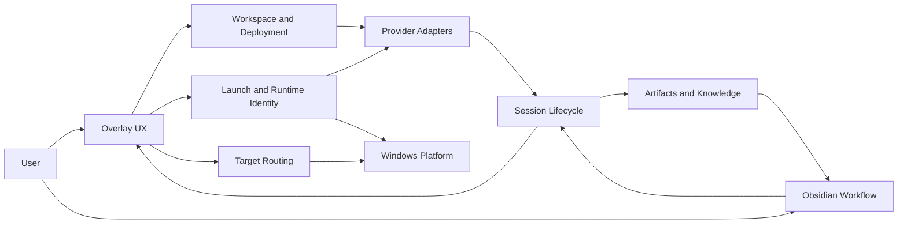

# AMO Product Module Architecture

Updated: 2026-07-15
Status: current logical architecture

This document is the top-level design map for AMO. It describes why the system is split into modules, which module owns each decision, how identities cross module boundaries, and what every launch entry means.

Use the surrounding documents for narrower questions:

- `docs/project-structure.md`: where implementation files live.
- `docs/runtime-architecture-v2.md`: how background runtime work stays outside the React interaction path.
- `docs/workspace-managed-launch-plan.md`: managed CLI identity and lifecycle details.
- `docs/managed-side-fork-plan.md`: persistent Codex side-chat forks, suppression, and parent/child lifecycle.
- `docs/window-routing-notes.md`: Win32 discovery, candidate selection, and activation.
- `docs/amo-obsidian-bridge-mvp.md`: note, Canvas, annotation, and return-to-target contracts.

This document owns the stable product boundaries above those implementation details.

## System Model

AMO is a local coordination layer. It does not execute model inference and does not replace Codex CLI, Claude CLI, ChatGPT desktop, or Obsidian.



The Broker is the authoritative coordination process for workspace records, launch intents, provider sessions, task state, target bindings, and artifact orchestration. Overlay and Obsidian are user surfaces. Tauri reports native Windows facts and performs native actions.

## Logical Modules

### 1. Workspace And Deployment

Owns:

- explicit project enrollment
- project-local `.amo` layout and Obsidian vault creation
- adapter inspection, deployment, update, and local Git exclude
- workspace registry and maintenance status
- project documentation mappings

Source of truth:

- project-local `.amo/workspace.json` and `.amo/enrollment.json`
- Broker workspace registry is an index, not enrollment authority

Must not own:

- provider session state
- window identity
- card creation from deployment

Current implementation anchors:

- `broker/lib/workspace-inspect.js`
- `broker/lib/workspace-deploy.js`
- `broker/lib/workspace-registry.js`
- `broker/lib/workspace-maintenance.js`
- `overlay/src/windows/DeployWorkspaceApp.tsx`

### 2. Provider Adapters And Event Intake

Owns:

- provider-specific hook installation
- provider payload normalization
- lifecycle event mapping such as running, permission, stop, review, failure, and interruption
- propagation of `workspaceId`, `launchId`, `sessionId`, and `turnId`

Source of truth:

- the provider owns `sessionId` and `turnId`
- deployed hook protocol defines evidence transported to the Broker

Must not own:

- visual card layout
- target window selection
- note rendering
- inferred launch ownership from PID, title, CWD, or timing

Current implementation anchors:

- `broker/hooks/codex.js`
- `broker/hooks/claude.js`
- `broker/lib/conversation-service.js`
- `broker/lib/transcript-monitor.js`

### 3. Session Lifecycle And Attention

Owns:

- one durable task card per provider session
- session state, attention, review, archive, and dismiss policy
- hook-event reconciliation and session persistence
- the rule that a new hook revives an archived session
- notifications derived from actionable session state

Source of truth:

- Broker session store keyed by provider `sessionId`

Must not own:

- the lifetime of a terminal process
- the layout of generated notes
- native window matching policy

Current implementation anchors:

- `broker/lib/session-store.js`
- `broker/lib/permission-gate.js`
- `broker/routes/sessions.js`
- `overlay/src/domain/sessionModel.ts`
- `overlay/src/hooks/useSessionActions.ts`
- `overlay/src/hooks/useAttentionVisuals.ts`
- `overlay/src/hooks/useWindowsNotifications.ts`

### 4. Launch And Runtime Identity

Owns:

- starting a new CLI in an enrolled workspace
- resuming an existing provider session in a new managed CLI
- generating and persisting one `launchId` per managed CLI process instance
- launch claim, mismatch, connected, offline, retry, and supersede transitions
- injecting managed-launch environment variables

Source of truth:

- Broker launch store keyed by `launchId`

Must not own:

- provider conversation identity
- manual window bindings
- ChatGPT task bindings
- card creation before a provider hook proves a real session

Current implementation anchors:

- `broker/lib/workspace-launch.js`
- `broker/lib/terminal-launch.js`
- `broker/lib/launch-store.js`
- `overlay/src/hooks/useTargetActivation.ts`
- `overlay/src/runtime/managedWindowMonitor.ts`

### 5. Target Routing And Activation

Owns:

- explicit ChatGPT task targets
- manual window candidate selection and drag-to-window binding
- activation of a bound or managed target
- validation and release of stale runtime window hints
- routing fallback when no strong target exists

Source of truth:

- Broker `targetBinding` stored on the provider session
- native HWND/PID/title data is an ephemeral routing fact, not conversation identity

Must not own:

- managed launch claims
- provider session mutation based on window title guesses
- creation of notes or cards

Current implementation anchors:

- `broker/lib/target-binding.js`
- `overlay/src/domain/routingModel.ts`
- `overlay/src/hooks/useTargetActivation.ts`
- `overlay/src/platform/windowClient.ts`
- `overlay/src-tauri/src/windows.rs`

### 6. Conversation Artifacts And Knowledge

Owns:

- prompt/reply note creation
- session-scoped artifact layout
- base Canvas append and edge creation
- note index, display title, annotations, and pending prompt rendering
- cleanup of generated artifacts without deleting user-owned work

Source of truth:

- project-local AMO vault files and metadata
- provider session/turn identities carried into artifact metadata

Must not own:

- live Obsidian tab state
- Canvas renderer internals
- CLI window activation

Current implementation anchors:

- `broker/lib/conversation-artifacts.js`
- `broker/lib/canvas-writer.js`
- `broker/lib/pending-prompts.js`
- `broker/lib/obsidian-bridge.js`

### 7. Obsidian Human Workflow

Owns:

- active note and selected Canvas note discovery
- annotation insertion, quote annotation, copy, and deletion UX
- AMO title presentation and note/header behavior
- note/Canvas open reuse, reveal, focus, and work-Canvas actions
- returning annotations to the selected session target

Source of truth:

- Obsidian workspace state for active leaf, editor selection, and Canvas selection
- Broker contracts for session linkage and sync-back

Must not own:

- Broker session lifecycle
- managed CLI launch identity
- replacement of Obsidian Canvas rendering or node DOM

Current implementation anchors:

- `broker/assets/obsidian/md-anno-tools/src`
- `docs/agnets/obsidian-canvas-development-guidelines.md`

### 8. Overlay, Platform, And Operations

Owns:

- cards, filters, search, deploy/settings/scratchpad windows, and visible feedback
- tray, taskbar state, Windows notifications, clipboard, dialogs, URI/path opening, and shortcuts
- thin React adapters around runtime controllers
- health, debug logging, startup, portable packaging, and release scripts

Source of truth:

- visible UI state may be local and disposable
- durable product state must come from the Broker or project-local workspace files

Must not own:

- hidden business policy inside presentational components
- long-lived native polling in React components
- direct session mutation without a Broker command

Current implementation anchors:

- `overlay/src/components`
- `overlay/src/windows`
- `overlay/src/runtime`
- `overlay/src/platform`
- `overlay/src-tauri/src`
- `scripts/amo` and `scripts/release`

## Identity Model

These identities must remain separate:

| Identity | Owner | Lifetime | Meaning |
| --- | --- | --- | --- |
| `workspaceId` | AMO deployment | project enrollment | One enrolled project and AMO vault |
| `sessionId` | Provider | conversation lifetime | One durable task card and conversation history |
| `turnId` | Provider | one user/agent turn | Prompt/reply artifact correlation |
| `launchId` | Broker | one managed CLI runtime | Proof that AMO launched a specific CLI instance |
| `targetBinding` | Broker/user | current routing lease | Where Open/Return should go now |
| `noteId` / artifact path | AMO vault | artifact lifetime | One generated or user-promoted knowledge item |

Never replace one identity with another. In particular:

- PID and HWND are not `sessionId` or `launchId`.
- A project path is not a session identity.
- A ChatGPT target is not a managed CLI launch.
- A card is not a terminal window.

## Launch And Routing Command Model

Every UI entry must map to one of these commands:

| Command | Meaning | Creates `launchId` | Creates a card | Changes target binding |
| --- | --- | ---: | ---: | ---: |
| Launch workspace CLI | Start a new Codex/Claude CLI in a project | Yes | Only after hook | After hook claim |
| Open workspace App | Open a new ChatGPT task for a project | No | No | No |
| Resume managed session | Resume one existing session in a new CLI | Yes | Reuses card | After hook claim |
| Open provider target | Open the current Codex task in ChatGPT | No | Reuses card | Optional/explicit |
| Bind/focus window target | Select or activate a CLI/app window | No | No | On explicit confirm |

Do not add a sixth behavior under a reused label. If a future entry has different state effects, define a new command contract first.

## Current Launch Entry Matrix

| Surface | Entry | Command | Current behavior |
| --- | --- | --- | --- |
| Deploy window | Run Codex / Run Claude | Launch workspace CLI | Starts managed CLI; no card until hook |
| Deploy window | Open ChatGPT | Open workspace App | Opens a new ChatGPT task in the selected project |
| Card header `+` | Managed Codex / Managed Claude | Launch workspace CLI | Starts a new project CLI unrelated to the source card session |
| Card header `+` | Open ChatGPT | Open workspace App | Opens a new task in the card's project; does not bind the card |
| Card managed shortcut | Terminal icon | Resume managed session | Resumes the current provider session |
| Card App shortcut | App icon | Open provider target | Opens and binds the current Codex session |
| Card action row | Resume CLI / Retry CLI | Resume managed session | Reuses the card and waits for hook claim |
| Card action row | App | Open provider target | Opens and binds the current Codex session |
| Choose Target | Managed CLI | Resume managed session | Explicit fallback when no suitable window is selected |
| Choose Target | ChatGPT | Open provider target | Opens the current task; binding follows the toggle |
| Choose Target | Window candidate | Bind/focus window target | Focuses or explicitly binds selected HWND |
| Bound card / Return action | CLI or App target | Bind/focus or open provider target | Activates existing target; does not launch a new session |

Rules:

- Deployment never creates a card.
- A project-level ChatGPT launch never creates or binds a card.
- A session-level ChatGPT action applies only to Codex sessions.
- `Managed` describes CLI launch identity, not ChatGPT desktop.
- All project-level launch entries use the same workspace launch service.
- All session-level resume entries use the same session resume service.
- UI components render availability; they do not implement launch policy independently.

### Unified Launch Dialog And Claude Routing

Workspace Run actions and the card header `+` action open the same launch dialog. Their context differs, but their launch policy does not:

- Workspace context starts an independent project task and has no source card.
- Card context starts an independent project task and shows the source card only as orientation.
- Neither context reuses or resumes the source card session.
- Resume remains a separate command and must not silently reuse the project-launch behavior.

The dialog owns client selection. When `claude-cli` is selected, it also owns one mutually exclusive provider preset:

- `anthropic-default`: use the existing Claude Code account and local configuration.
- `deepseek-v4`: use the official DeepSeek Anthropic-compatible endpoint and V4 model mapping.
- `glm-5.2`: use the official GLM Anthropic-compatible endpoint and 1M model mapping.

Provider selection is radio-style, not a checkbox set. One Claude process can use only one endpoint/model mapping at launch time.

Model settings and security rules:

- The Settings `Models` section owns the default Claude provider and remembered provider credentials.
- The default provider ID is an ordinary non-secret preference and may be stored in local storage.
- Remembered DeepSeek and GLM keys are stored as generic credentials in Windows Credential Manager for the current Windows user.
- Settings never reads a saved key back into an editable field. It exposes only configured/not-configured state and replace/clear commands.
- The launch dialog selects the configured default, permits a one-launch override, and resolves a remembered key only when the user confirms launch.
- The Broker validates a known preset and creates a per-launch Claude `--settings` file under `%LOCALAPPDATA%\AgentMonitorOverlay\runtime\claude-launches`.
- That temporary file contains the selected provider mapping and key so command-line settings override conflicting user-level `~/.claude/settings.json` environment values.
- The key is never embedded in PowerShell `-EncodedCommand`, workspace files, launch snapshots, session snapshots, local storage, or debug logs.
- The temporary file is removed by the terminal wrapper as soon as Claude exits. Files left by a forced terminal/process shutdown are removed by best-effort stale cleanup after seven days.
- Launch/session state may retain only non-secret `claudeProviderId` and `claudeModel` metadata.
- Resume resolves the remembered key again and reuses the provider stored on the card, so provider routing remains stable across a managed resume.

ChatGPT desktop keeps the `codex://` URL scheme for compatibility. AMO also keeps the serialized IDs `codex-app` and `codex-app-thread` so existing cards and bindings remain readable. These are compatibility identifiers, not the current user-facing product name.

## Primary Flows

### New Managed CLI

```text
Workspace launch entry
  -> Broker validates enrollment and adapter
  -> Launch store creates launchId
  -> terminal starts with AMO identity environment
  -> provider hook carries launchId + sessionId
  -> launch claim connects runtime to provider session
  -> session card appears or revives
```

### Open A New ChatGPT Task In A Workspace

```text
Workspace App entry
  -> Broker validates the workspace and returns codex://threads/new?path=<absolute-workspace-path>
  -> Tauri passes the URI to Windows ShellExecuteW
  -> ChatGPT opens a new task with that project as its active workspace
  -> no launchId, card, or target binding is created
```

### Open Current Session In ChatGPT

```text
Card/Candidate App action
  -> construct codex://threads/<sessionId>
  -> optionally persist ChatGPT target binding
  -> Tauri opens URI
  -> existing card remains the durable session
```

### Hook To Knowledge Artifact

```text
Provider hook
  -> normalize provider event
  -> update session lifecycle
  -> create prompt/reply artifact when applicable
  -> append base Canvas node/edge
  -> publish Broker session event
  -> Overlay and Obsidian refresh their views
```

### Annotation Return

```text
Obsidian selection/annotation
  -> plugin sends structured annotation payload
  -> Broker resolves provider session and target binding
  -> safe text is copied
  -> target is opened/focused
  -> user reviews and submits manually
```

## Dependency Rules

Allowed direction:

```text
UI -> domain command -> Broker service -> state/artifact owner
UI -> runtime controller -> platform port -> Tauri/Windows
Provider hook -> event intake -> session lifecycle -> artifacts/UI events
Obsidian plugin -> bridge API -> Broker session/artifact services
```

Disallowed direction:

- component directly edits Broker session state
- hook adapter reaches into card rendering
- artifact writer activates windows
- Tauri decides session or attention policy
- Obsidian plugin claims managed launch ownership
- launch service invents a provider `sessionId`
- window matcher binds automatically from PID/CWD/title without explicit or launch identity evidence

## Extension Checklists

### Add A Provider

Decide each capability independently:

- hook capture
- lifecycle mapping
- project-local deployment
- new managed launch
- session resume
- explicit provider target
- artifact generation

Do not describe a provider as supported when only one capability exists. ChatGPT desktop, for example, is currently a workspace/task target but not a hook adapter or managed CLI.

### Add A Launch Entry

1. Select one command from the launch and routing model.
2. Reuse its existing Broker/Tauri service.
3. Apply the same availability rule as other entries for that command.
4. Verify whether it creates `launchId`, changes `targetBinding`, or waits for a hook.
5. Update the launch entry matrix when semantics change.

### Add A Card State

1. Define provider evidence and Broker transition.
2. Define attention and notification severity.
3. Define archive/revive behavior.
4. Add Overlay presentation last.
5. Do not derive durable state only from focus, HWND, or elapsed UI time.

### Add An Artifact Or Obsidian Action

1. Choose the session/turn identity carried into metadata.
2. Keep generated and user-owned files distinguishable.
3. Keep Canvas changes within JSON Canvas and public plugin surfaces.
4. Define return routing separately from annotation creation.
5. Preserve manual submit and permission control unless product scope explicitly changes.

## Documentation Maintenance

Update this document when:

- a logical module is added, removed, or changes owner
- an identity or source-of-truth rule changes
- a launch/routing entry gains new state semantics
- a provider gains or loses a capability

Update `docs/project-structure.md` when files move without changing product ownership. Update the topic documents when implementation details change inside an existing module. Historical plans may retain old checkpoints, but this document must describe current behavior only.
