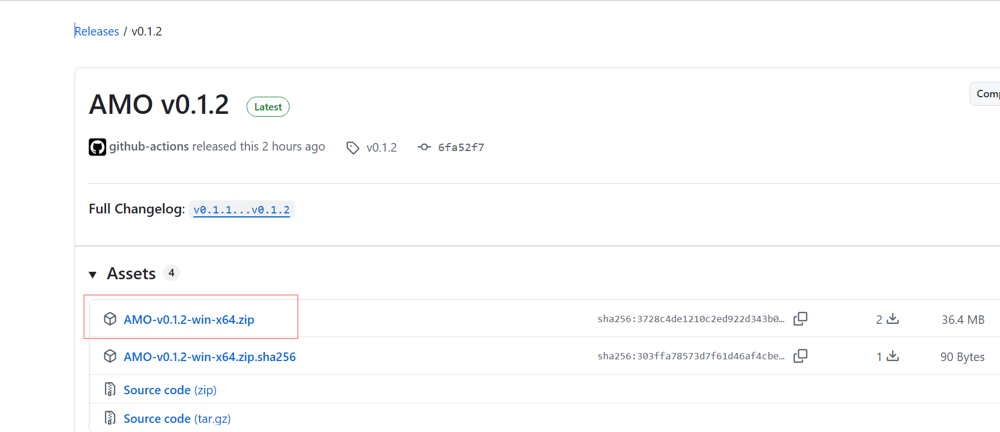
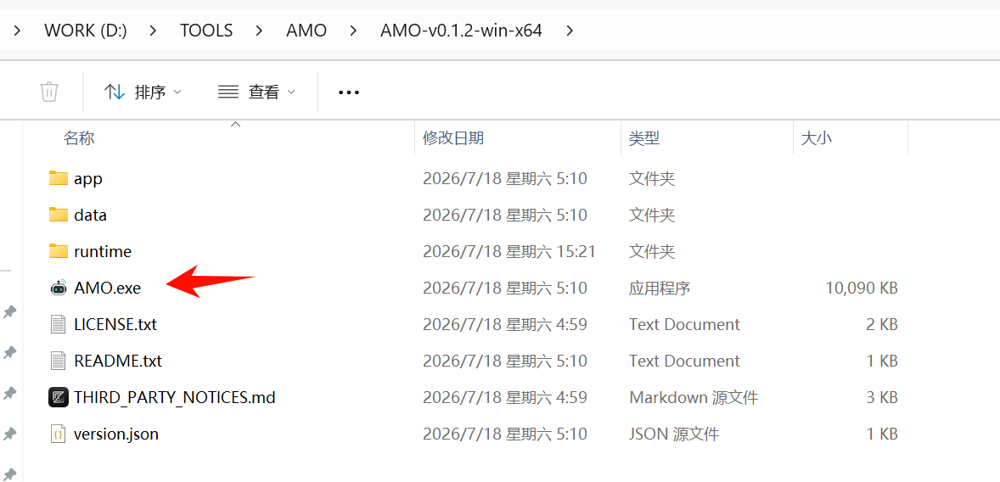
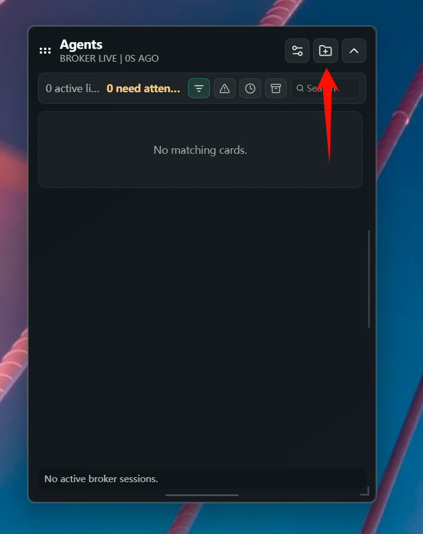
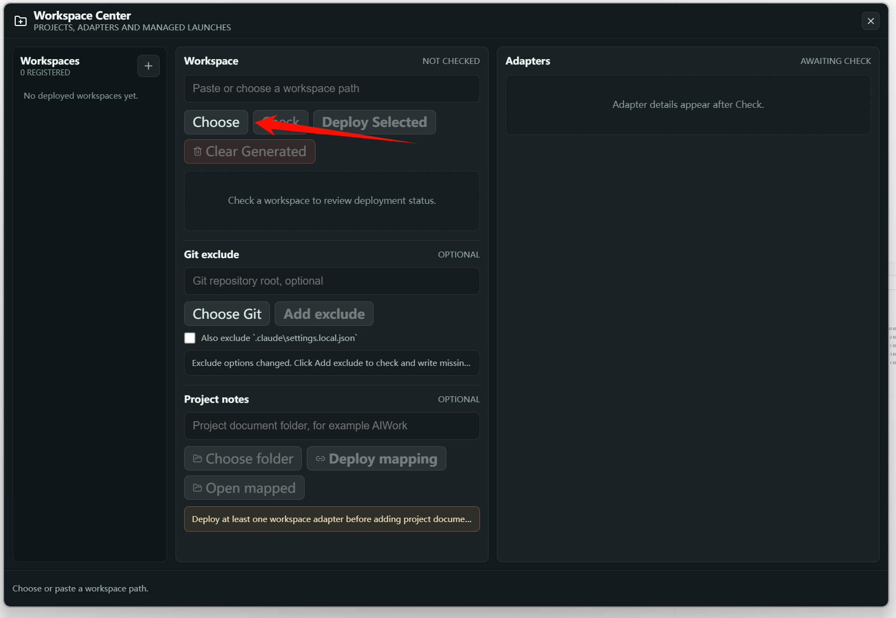
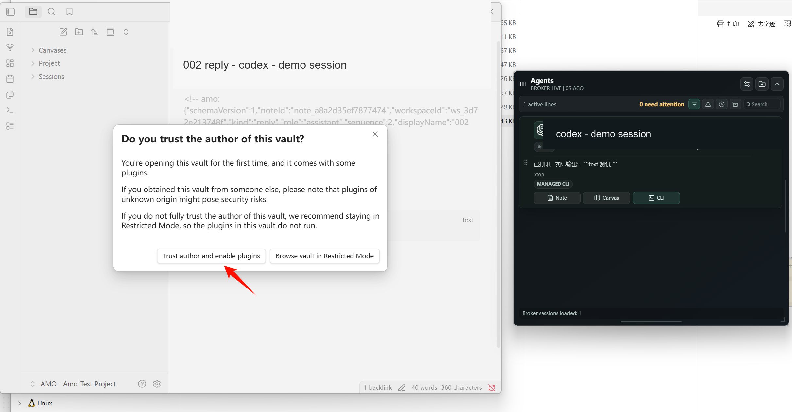
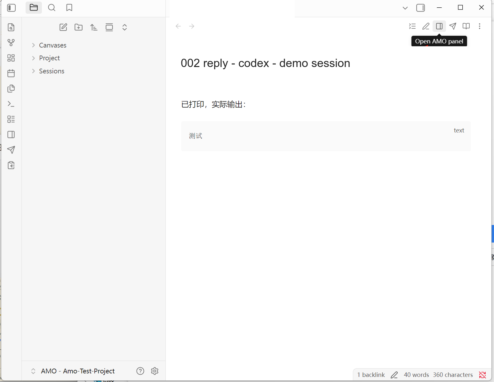
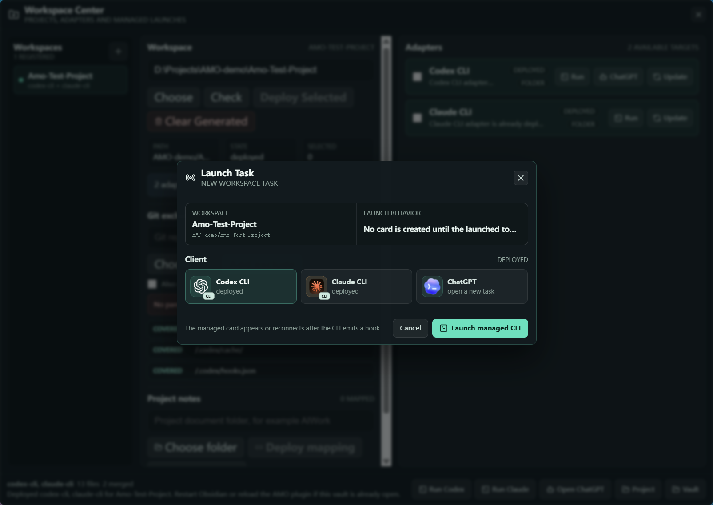
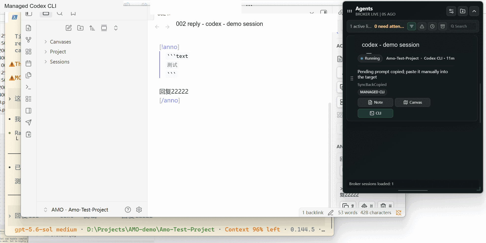

# Getting Started

This guide takes a clean Windows machine from an extracted AMO Portable build to the first reviewed CLI reply.

## Before You Start

Required:

- Windows 10 or Windows 11, x64;
- WebView2 Runtime;
- a writable project folder;
- at least one supported CLI already installed and available in PowerShell: `codex` or `claude`.

Optional but recommended:

- Windows Terminal for managed CLI windows;
- Obsidian for reply notes, annotations, and canvases;
- ChatGPT desktop app when a task should target the desktop app instead of a CLI window.

Normal Portable users do not need Node.js, npm, Rust, or a source checkout. AMO carries the Broker and its pinned Node runtime in the release folder.

## 1. Start AMO

Open [GitHub Releases](https://github.com/kadhygh/AgentMonitorOverlay/releases), expand the newest release's **Assets**, and download `AMO-v<version>-win-x64.zip`. The automatically generated `Source code` archives are repository snapshots, not runnable Portable packages.



To verify the download, keep the adjacent `.sha256` file and run the following commands from the download directory:

```powershell
$expected = ((Get-Content .\AMO-v<version>-win-x64.zip.sha256) -split '\s+')[0]
$actual = (Get-FileHash .\AMO-v<version>-win-x64.zip -Algorithm SHA256).Hash.ToLowerInvariant()
$actual -eq $expected
```

The final command must print `True`.

Extract the complete ZIP into a writable directory. Open the versioned folder and double-click `AMO.exe`; keep `AMO.exe`, `app/`, `runtime/`, and `data/` together.



Do not run the executable directly from inside the ZIP. Keep `AMO.exe`, `runtime/`, and `data/` together.

AMO starts its local Broker before loading the task-card UI. A brief readiness state is normal. A persistent `127.0.0.1 refused to connect` page means the Broker did not become ready; exit AMO and inspect the diagnostic log before retrying.

On a clean start, the header should report **BROKER LIVE**. With no active sessions, the card area is empty. Select the folder button in the upper-right toolbar to open Workspace Center.



## 2. Enroll A Workspace

Open **Workspace Center** from the folder icon. The deployment window is separate from the compact task-card window, so it can remain open while AMO continues monitoring sessions.

1. Select **Choose** and pick the project folder, or paste its absolute path into the Workspace field.
2. Select **Check** to inspect the folder. Check is read-only and does not deploy files.
3. Review the workspace state and each adapter row instead of assuming an empty folder is already deployed.
4. Select Codex CLI, Claude CLI, or both. An unavailable adapter cannot be selected until its CLI is installed and discoverable.
5. Select **Deploy Selected**. The per-adapter **Deploy** button performs the same operation for only that adapter.



After Check, the center column summarizes the workspace and the right column shows the detected adapters. The example below is an empty disposable project with both adapters selected and ready to deploy.


Deployment is script-driven. It writes project-local adapter files and creates the project's `.amo` folder; no LLM participates in this operation.

The Git exclude action can keep AMO-local artifacts out of commits. Treat `.claude/settings.local.json` separately: include it only when the project should keep that machine-local Claude configuration out of Git.

When deployment succeeds, the workspace appears in the left column, adapter rows report **DEPLOYED**, and Run/Update actions become available. If Obsidian already has this Vault open, reload Obsidian or the AMO plugin after an update.


Optional actions in the center column serve different purposes:

- **Choose Git / Add exclude** writes local exclusions for AMO-generated files when the project belongs to a Git repository.
- **Project notes / Deploy mapping** exposes an existing project documentation folder inside the AMO Vault.
- **Clear Generated** removes generated AMO content; do not use it as a normal update action.

## 3. Load The AMO Vault In Obsidian

AMO creates an Obsidian vault inside the project:

```text
<project>/.amo/obsidian-vault/
```

Obsidian must load that folder as a vault once before `obsidian://` links can reliably address it.

1. In Workspace Center, select **Vault**, or in Obsidian choose **Open folder as vault**.
2. Select `<project>/.amo/obsidian-vault` if Obsidian asks for a folder.
3. On the first open, verify that this is the Vault generated from the project you selected. If you trust that project and this AMO build, choose **Trust author and enable plugins**.
4. Confirm the AMO plugin is present and enabled. Reload Obsidian when a newly deployed or updated plugin is not visible yet.
5. Return to AMO and retry **Note** or **Canvas**.



If the vault has never been loaded, AMO shows a recovery dialog that can open the folder in Explorer or copy its path. Opening the folder in Explorer is not the same as loading it as an Obsidian vault.

With a generated reply Note open, select the book-shaped **Open AMO panel** button in the Obsidian toolbar. The panel appears on the right and exposes Note, annotation, return, and Canvas actions for the active AMO note.



## 4. Launch A Managed CLI

Use a launch action from Workspace Center or a task card. In a deployed adapter row, select **Run**, or use **Run Codex / Run Claude** in the bottom action bar. In the Launch Task dialog:

1. confirm the workspace shown at the top;
2. select Codex CLI or Claude CLI;
3. select **Launch managed CLI**;
4. wait for the new terminal before entering the prompt.



AMO injects a launch identity and records the managed window so later hooks can claim the correct task card.

### Claude Model Routing: GLM And DeepSeek

AMO can route only the Claude CLI process it launches through a configured DeepSeek or GLM Claude Code-compatible endpoint. Configure the credentials before the first managed launch:

1. open AMO Settings from the sliders button in the main window;
2. select **Models**;
3. enter the provider credential under **DeepSeek V4 Pro** or **GLM-5.2**;
4. select **Save key** and wait for the provider state to report **Configured**;
5. set **Default Claude model routing** when every new Claude Launch Task should preselect that provider.

The two presets currently map to:

| Launch option | Credential field | Main model |
| --- | --- | --- |
| DeepSeek V4 Pro | `DeepSeek API Key` | `deepseek-v4-pro[1m]` |
| GLM-5.2 | `GLM Coding Plan API Key` | `glm-5.2[1m]` |

To use or override the preset for one session:

1. return to Workspace Center and select **Run Claude**;
2. select **Claude CLI** in Launch Task;
3. under **Model routing**, choose **Claude default**, **DeepSeek V4 Pro**, or **GLM-5.2**;
4. if the selected provider is not saved, enter its key in the launch dialog; a saved key can also be overridden only for this launch;
5. select **Launch managed CLI**.

The provider environment applies only to that Managed Claude CLI process. AMO does not rewrite the user's global Claude Code configuration. Saved keys remain in Windows Credential Manager for the current Windows user; at launch, the selected key and routing variables are copied into a temporary Claude settings file that is removed when Claude exits. They are not stored in localStorage, Broker state, project files, or logs.

A CLI started manually can still produce hook cards, but AMO may require an explicit window choice or drag-to-bind action because the hook alone cannot always identify a Windows Terminal tab or pane.

Start one conversation and wait for its reply hook. The card should move through the running lifecycle and end in Review when a reply is ready.

The terminal starts in the selected project directory. After a reply hook arrives, the matching AMO card exposes **Seen**, **Note**, **Canvas**, and **CLI**. A **Review** state means a reply is ready for human attention; opening the CLI alone does not replace reviewing or handling the reply.


## 5. Review And Return

Select **Note** on the Review card. In Obsidian:

1. open the AMO panel if it is not already visible;
2. select only the sentence or lines that need a response;
3. select **批注** in the AMO panel to insert a quoted annotation marker;
4. write the complete instruction below the inserted quote;
5. review the annotation list in the panel and edit or delete entries if required;
6. select **返回窗口** to focus the corresponding Managed CLI;
7. paste or send the collected response when it is ready.

Opening Note, Canvas, App, CLI, or marking the card Seen clears the current review attention state. A later hook can wake an archived task again.


Use Scratchpad instead when the thought is temporary, incomplete, or not tied to one exact passage. Configure its shortcut in AMO Settings, invoke it while reading, switch among the three local pages, and select **Copy** only when the text is ready to paste into a CLI.



## First-Run Checklist

- AMO shows `BROKER LIVE` rather than a connection error.
- Workspace Check reports the actual deployment state.
- The selected adapter has a deployed version.
- Obsidian has loaded the generated vault once.
- The AMO Obsidian plugin version matches the expected version shown by the task-card settings.
- The managed CLI starts in the selected project directory.
- A completed reply creates a task card and generated note.
- Note and Canvas open without `Vault not found`.
- An annotation returns to the intended session.

## Where To Go Next

- [Reviewing With Notes](workflows/note-review.md)
- [Organizing Complex Work](workflows/canvas-work.md)
- [Shortcut Configuration](shortcut-configuration.md)
- [Local Data and Privacy](data-and-privacy.md)
- [Portable Release SOP](portable-release-sop.md)
