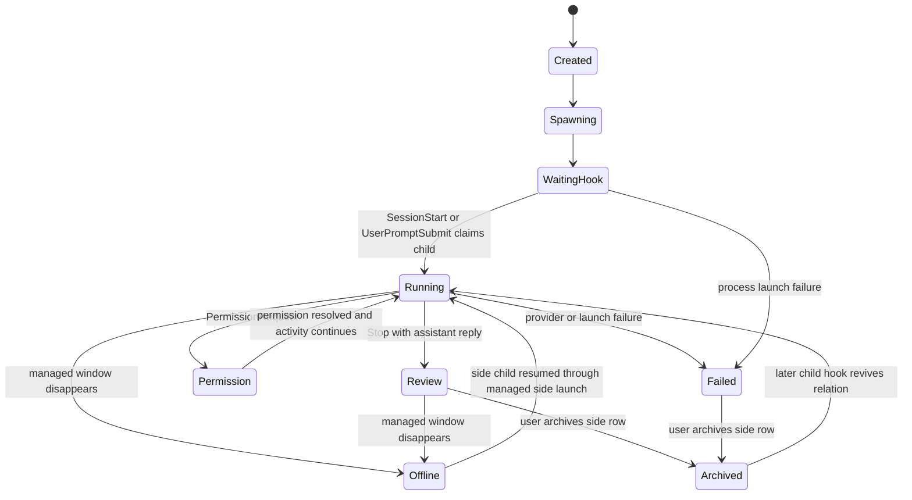

# Managed Side Fork Plan

Updated: 2026-07-16
Status: investigated and proposed; implementation not started

## Purpose

AMO needs a lightweight way to branch a focused question from an existing Codex task without adding another normal task card or polluting the task's Obsidian conversation flow.

The product-facing name is **Side Chat**. The implementation model is **Managed Side Fork** because the first CLI implementation uses Codex's persistent `fork` command rather than the ephemeral `/side` command.

This document owns the launch identity, hook routing, lifecycle, persistence, and Overlay behavior for that feature. The future Obsidian entry may reuse the same Broker contract, but it is not part of the first implementation.

## Verified Provider Capability

The local verification environment is:

- Codex CLI: `0.144.4`
- `codex fork`: stable CLI command
- `codex resume`: separate stable CLI command

The installed CLI exposes:

```text
codex fork [OPTIONS] [SESSION_ID] [PROMPT]
```

Evidence sources:

- local `codex --version` and `codex fork --help`, verified on 2026-07-16
- [Codex CLI command reference](https://learn.chatgpt.com/docs/developer-commands?surface=cli#cli-codex-fork)
- [Codex CLI slash commands](https://learn.chatgpt.com/docs/developer-commands.md?surface=cli)

Relevant behavior:

- `SESSION_ID` identifies the parent conversation.
- `PROMPT` is optional and starts the first child turn when supplied.
- `-C <DIR>` selects the child task's working root.
- The original transcript is preserved and the fork becomes a new saved task with a new provider `sessionId`.

The intended AMO command is therefore conceptually:

```powershell
codex fork <parent-session-id> <question> -C <workspace-path>
```

AMO must not launch `codex resume`, inject `/fork`, paste the question, or synthesize Enter key input. Direct `codex fork` is both simpler and less timing-sensitive.

Official Codex behavior also distinguishes:

- `codex fork` and `/fork`: persistent new task.
- `/side` and `/btw`: ephemeral side conversation that does not disrupt the main transcript.
- app-server `thread/fork`: programmatic fork with a new thread id, but app-server remains an experimental integration surface and is not required for the CLI MVP.

The current user need includes a dedicated CLI window and a branch that can be revisited, so persistent fork semantics are the better first fit. If AMO later implements a truly disposable conversation, that must be a separate `ephemeral-side` mode rather than silently changing this contract.

## Terminology

| Product term | Internal term | Meaning |
| --- | --- | --- |
| Side Chat | Managed Side Fork | User-visible branch created by AMO through `codex fork` |
| Parent task | `parentSessionId` | Existing normal AMO/Codex task supplying transcript context |
| Side task | `childSessionId` | New Codex session created by the fork |
| Side launch | `launchId` with `role: side-chat` | Dedicated managed CLI process that owns the child session |
| Promote | Future operation | Convert a side task into a normal AMO task card and artifact flow |

Use `side-chat` for the launch role and `fork` for the provider command mode. Do not overload ordinary `resume` launch semantics.

## Entry Eligibility

The first Overlay entry lives in the existing card `+` launch panel.

Show `Create Side Chat` only when all of the following are true:

- provider is Codex CLI
- the card has a valid provider `sessionId`
- the card resolves to an enrolled workspace
- the Codex CLI adapter is deployed and currently supports `codex fork`
- the card is idle or waiting for review
- the card has an explicit current CLI target or a connected managed CLI

The provider `sessionId`, not the window binding, is the actual fork identity. Requiring a bound target in the first release is a conservative UX gate that matches the requested workflow; the Broker API must not treat HWND, PID, or title as the parent identity. A later iteration may safely allow an offline parent card when its session and workspace remain valid.

Do not offer the action while the parent is:

- running
- waiting for permission or user input
- launching
- failed without a valid session identity
- a Claude task
- already a side task

## Overlay Interaction

Clicking the card `+` continues to open the project launch panel. Eligible Codex cards gain a separate `Create Side Chat` action above the ordinary new-tool actions.

Selecting it opens a focused second-level dialog containing:

- parent task title
- project name and short workspace path
- a multiline question input
- `Create Side Chat` and `Cancel` commands

First-release input rules:

- a non-empty question is required
- Enter inserts a newline
- `Ctrl+Enter` submits
- Escape closes without launching
- cap input at 4,000 characters for predictable Windows command-line size
- do not retain the full prompt in Broker launch diagnostics

The normal launch choices still mean "start an unrelated new task in this project." Side Chat means "fork this exact task with inherited transcript context." These actions must remain visually and semantically distinct.

## Why A Separate Side Chats Area Is Recommended

Completely hiding the fork would avoid normal-card noise, but it would also hide:

- launch failure
- running/completed state
- permission requests
- offline window state
- the action needed to return to the side CLI

The recommended UI is a compact, collapsible **Side Chats** area outside the normal task-card list. It is not a second full card list.

Each row should show:

- short side title or first-question preview
- parent task title
- provider icon
- state: launching, running, review, permission, offline, or failed
- focus/open action
- close/archive action

Normal task counters, filters, ordering, archive, Obsidian Note/Canvas buttons, and base-card attention visuals must not include side rows. A side permission request still needs the highest taskbar severity because it blocks work; side review may use the normal low-severity green notification without creating a normal card.

The first implementation may use a compact count in the header plus a popover list if that is materially simpler than an always-visible section. It must still provide a discoverable way to return to every live side CLI.

## Managed Launch Contract

Extend the managed launch record without changing the meaning of ordinary launches:

```json
{
  "launchId": "launch_xxx",
  "workspaceId": "ws_xxx",
  "workspacePath": "G:\\PROJECT\\SomeProject",
  "adapterId": "codex-cli",
  "mode": "fork",
  "role": "side-chat",
  "sourceCardSessionId": "parent-session-id",
  "parentSessionId": "parent-session-id",
  "childSessionId": null,
  "state": "waiting_hook",
  "titleToken": "[AMO:SIDE:xxxxxxxx]"
}
```

The terminal title should be recognizable to the user, for example:

```text
[AMO:SIDE:xxxxxxxx] Codex Side - project_mining_dev
```

Windows Terminal must continue using `--suppressApplicationTitle` so Codex cannot replace the AMO routing token. The title is a window activation hint and visual label only. It is never hook ownership evidence.

Launch environment:

```text
AMO_LAUNCH_ID=<launch id>
AMO_WORKSPACE_ID=<workspace id>
AMO_WORKSPACE_PATH=<workspace path>
AMO_LAUNCH_ROLE=side-chat
AMO_PARENT_SESSION_ID=<parent session id>
```

The current deployed hooks already send `AMO_LAUNCH_ID`. Because the Broker launch store is authoritative for role and parent identity, the first MVP does not require a hook deployment-version bump. The extra environment fields are useful diagnostics and future compatibility, but the Broker must reject any role claimed only by an untrusted payload when its `launchId` does not resolve to a matching launch record.

## Hook Routing

The fork process inherits the AMO launch environment. The child session's `SessionStart`, `UserPromptSubmit`, `Stop`, `PermissionRequest`, and tool events therefore carry the side launch's `launchId`.

Current event intake calls `launchStore.claim(...)` before normal event, prompt, and reply processing. The side-chat decision must happen immediately after that claim and before these paths:

- `sessionStore.upsertSessionFromEvent`
- `conversationService.handlePrompt`
- `conversationService.handleReply`
- permission handling that targets a normal card
- transcript monitoring attached to a normal session
- normal session persistence and event publication

Routing rule:

```text
valid launchId + launch.role == side-chat
    -> sideChatService handles event
    -> return side result
    -> do not continue into normal session/artifact flow
otherwise
    -> existing normal AMO flow
```

This prevents side hooks from creating:

- a normal task card
- a prompt or reply note
- an AgentFlow base-canvas node or edge
- a normal review counter
- a normal card notification
- a managed binding transfer on the parent card

Do not filter by title, process id, HWND, workspace path, prompt text, or a timing window. Those values can help diagnostics or window discovery but cannot prove side-chat ownership.

## Side Chat Store

Persistent fork semantics require persistent AMO classification. Add a small Broker-owned store, conceptually `broker/data/side-chats.json`:

```json
{
  "schemaVersion": 1,
  "sideChats": [
    {
      "sideChatId": "side_xxx",
      "launchId": "launch_xxx",
      "workspaceId": "ws_xxx",
      "workspacePath": "G:\\PROJECT\\SomeProject",
      "parentSessionId": "parent-session-id",
      "childSessionId": "child-session-id",
      "provider": "codex",
      "state": "review",
      "questionPreview": "Investigate whether...",
      "questionLength": 142,
      "createdAt": "2026-07-16T00:00:00.000Z",
      "updatedAt": "2026-07-16T00:05:00.000Z"
    }
  ]
}
```

Do not persist the complete initial question in this store. Keep only a bounded preview, length, and optional hash. The full prompt already exists in the provider transcript, and current debug logging must redact the prompt argument from launch records.

Once the first child hook supplies `childSessionId`, classification becomes durable by both `launchId` and child session id. If the user later resumes that child session outside the original launch, AMO should continue treating it as a side task until the user explicitly promotes or removes the relation. Otherwise the child would unexpectedly reappear as a normal card after restart or manual resume.

Removing an AMO side-chat record must not delete the Codex session. Provider-session deletion remains an explicit provider operation.

## Parent Isolation

Creating and claiming a side fork must not mutate these parent-card fields:

- `launchId`
- `launchState`
- `windowHint`
- `targetBinding`
- state or attention
- review state
- archive state
- active turn

The side launch uses a fresh `launchId`. Its first child hook binds only the side record. The existing parent CLI remains bound to the parent task and can continue to be focused normally.

This is different from manually entering `/fork` in an already managed parent CLI. That manual operation inherits the parent's existing launch identity and may look like a session transfer under current rules. The first feature scope guarantees special classification only for forks created through AMO's Side Chat action.

## Proposed Broker API

Prefer a dedicated intent endpoint that reuses the shared terminal-launch service internally:

```text
POST /api/sessions/:parentSessionId/side-chats
```

Request:

```json
{
  "prompt": "Investigate this question without changing the parent task.",
  "launchEnvironment": "windows-terminal-pwsh7"
}
```

Response:

```json
{
  "ok": true,
  "sideChat": {
    "sideChatId": "side_xxx",
    "parentSessionId": "parent-session-id",
    "childSessionId": null,
    "state": "waiting_hook"
  },
  "launch": {
    "launchId": "launch_xxx",
    "role": "side-chat",
    "mode": "fork"
  }
}
```

Additional first-release endpoints:

```text
GET    /api/side-chats
POST   /api/side-chats/:sideChatId/activate
POST   /api/side-chats/:sideChatId/archive
```

`activate` uses the side launch's own managed window identity. If the window is offline and `childSessionId` is known, a later iteration can launch `codex resume <childSessionId>` with a new `role: side-chat` launch. Do not reuse the parent resume endpoint for this.

## Lifecycle



There is deliberately no automatic timeout that reclassifies an active side launch as a normal task. A launch may remain at the prompt before the first turn for an arbitrary amount of time. Window/process evidence may mark it offline, but only explicit identity can change its role.

## Failure And Recovery Rules

- CLI executable missing: mark side launch failed; no normal card.
- `codex fork` rejects the parent session: show command failure in Side Chats; keep parent unchanged.
- Broker unavailable when hooks fire: Codex still runs; later hooks can claim the persisted launch when Broker returns. The side row may remain waiting/offline until evidence arrives.
- First hook reports a different workspace/provider: reject claim and keep diagnostic state; do not silently create a normal card from a launch that claims side ownership incorrectly.
- Child hook arrives without launch id but child id already exists in side store: route by durable child relation.
- Side window closes: mark side offline; do not archive or promote.
- Parent card is archived or dismissed: preserve the side relation and parent id; show a fallback parent label if the normal card is not visible.
- AMO restarts: reload launch and side-chat stores before accepting hooks.

## Artifact Policy

The first CLI MVP does not create Obsidian notes or base-canvas nodes for side chats. The provider transcript is the source of truth for the fork.

This keeps exploratory questions from expanding `AgentFlow.base.canvas`, which is one of the primary reasons to introduce Side Chat.

Future options, each requiring an explicit user action:

- `Promote to task`: create a normal card and begin normal notes/canvas flow from the next turn.
- `Save result as note`: write one selected side reply into the parent session's knowledge area without importing the whole fork.
- `Create from annotation`: use annotation content and note metadata as the first prompt, while reusing the same managed-side-fork API.

Do not retroactively write all side turns into the base canvas merely because the side is promoted.

## Implementation Phases

### Phase 1: Broker Contract And Tests

- add `mode`, `role`, and parent relation to managed launches
- add side-chat store and service
- add dedicated create/list/archive routes
- launch `codex fork` through the existing terminal launcher
- route side hooks before normal session and artifact services
- redact prompt arguments from debug and API diagnostics
- add lifecycle, identity, restart, and parent-isolation tests

### Phase 2: Overlay Entry And Side Area

- add eligible `Create Side Chat` action to the card `+` panel
- add second-level question dialog
- add compact Side Chats status UI
- add focus and archive actions
- integrate side permission/review severity without normal-card creation

### Phase 3: Real CLI Smoke

- create side chat from a connected idle Codex card
- verify exact parent transcript is inherited
- verify child receives a different provider session id
- verify initial question is sent once
- verify no normal card, note, or base-canvas node appears
- verify parent binding and review state remain unchanged
- verify side running/review/permission/offline states
- restart AMO and verify classification survives
- resume the child and verify it stays in Side Chats

### Phase 4: Obsidian Entry

- add `Create Side Chat` beside the annotation return action
- compose source note, selected annotation, and optional question
- use the same Broker endpoint and side area
- keep annotation source metadata as relation metadata, not as a normal prompt note

### Later

- promote side to normal task
- save selected side result to Obsidian
- investigate true ephemeral `/side` support separately
- investigate Claude provider branching only after its CLI exposes an equally reliable contract
- consider app-server `thread/fork` only if AMO needs direct child-id acquisition or richer process control and the API is stable enough

## Acceptance Criteria

The feature is ready for the first real-use trial only when:

1. A bound idle/review Codex card can launch a fork with one question.
2. The child inherits parent context and has a distinct provider `sessionId`.
3. No side hook creates or updates a normal task card.
4. No side prompt/reply creates a generated note or base-canvas node.
5. Parent target binding and lifecycle state never change because of the fork.
6. Side running, review, permission, failure, and offline states remain visible in a compact surface.
7. Clicking a side row focuses only its dedicated managed CLI.
8. Restarting AMO preserves parent/child classification.
9. A later hook from the child cannot revive it as a normal card unless the user explicitly promotes it.
10. Debug logs contain launch ids, state, prompt length, and bounded preview/hash, but never the full question.

## Recommended First Cut

Implement Codex CLI only, persistent managed fork only, and no Obsidian artifacts. Use the existing card `+` entry and terminal-launch infrastructure, but create a dedicated side-chat intent and store. Show side sessions in a compact independent area rather than normal cards or total invisibility.

This is the smallest version that remains observable, recoverable, and consistent with AMO's identity model.
